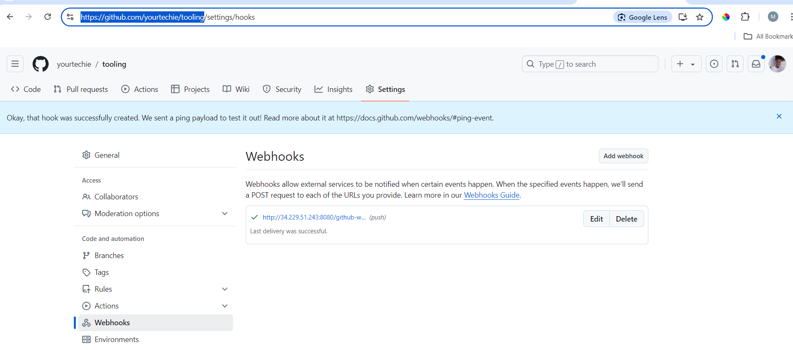
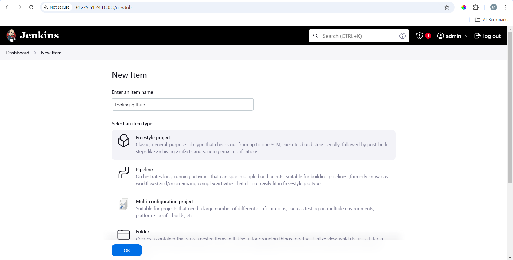
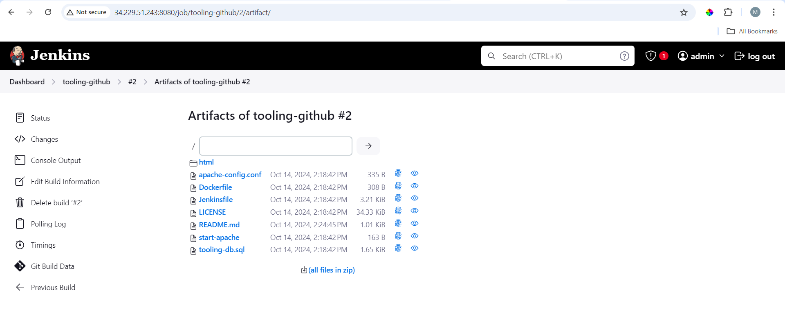

# Tooling Website Deployment Automation with Continuous Integration

## Introduction to Jenkins-101

In a previous project, we introduced the concept of **horizontal scalability**, which allows us to add new web servers to our Tooling Website and successfully set up a configuration with two web servers and a load balancer to distribute traffic between them. For small-scale environments with just a few servers, configuring them manually isn't a big challenge. However, scaling to dozens or even hundreds of servers would require a repetitive and time-consuming setup.

**DevOps** practices are centered around agility and speedy software releases. One of the ways to guarantee fast and repeatable deployments is through the **automation of routine tasks**.

In this project, we'll automate part of our routine tasks using **Jenkins**, a free and open-source automation server. Jenkins is one of the most popular **CI/CD** tools, initially created by a former Sun Microsystems developer, Kohsuke Kawaguchi, and originally named "Hudson."

According to Circle CI, **Continuous Integration (CI)** is a software development strategy that increases development speed while ensuring code quality. Developers continually commit code in small increments (at least daily, or even several times a day), which is then automatically built and tested before being merged with the shared repository.

In this project, we will utilize Jenkins' CI capabilities to ensure that every change made to the source code in the GitHub repository is automatically updated on the Tooling Website.

## Task
Enhance the architecture prepared in the previous project by adding a Jenkins server and configuring a job to automatically deploy source code changes from GitHub to the NFS server.

**Updated Architecture:**

Upon completing this project, your updated architecture will include a Jenkins server integrated into the setup.
   

## Step 1 - Install Jenkins Server

### 1. Create an AWS EC2 Server
- Launch an EC2 instance using **Ubuntu Server 24.04 LTS**.
- Name the instance **"Jenkins-Server"**.
- COnnect to the instance.
   

### 2. Install Java Development Kit (JDK)
Since Jenkins is a Java-based application, you'll need to install JDK on your Jenkins server.
```bash
sudo apt update
sudo apt install default-jdk-headless
```
   
   

### 3. Install Jenkins
- Add the Jenkins repository and its GPG key:
```bash
sudo wget -O /usr/share/keyrings/jenkins-keyring.asc \
  https://pkg.jenkins.io/debian-stable/jenkins.io-2023.key
```
- Add the Jenkins repository to your server’s sources list:
```bash
echo "deb [signed-by=/usr/share/keyrings/jenkins-keyring.asc]" \
  https://pkg.jenkins.io/debian-stable binary/ | sudo tee \
  /etc/apt/sources.list.d/jenkins.list > /dev/null
  ```
   

- Update the package list and install Jenkins:
```bash
sudo apt update
sudo apt-get install jenkins
```
   


### 4. Verify Jenkins Installation
Ensure Jenkins is up and running.
```bash
sudo systemctl status jenkins
```
   

### 5. Configure Security Group
By default, Jenkins uses TCP port **8080**. Open this port by creating a new inbound rule in your EC2 Security Group.
   

### 6. Initial Jenkins Setup
- Access Jenkins in your browser using `http://<Jenkins-Server-Public-IP-Address-or-Public-DNS-Name>:8080`.
- You will be prompted to provide a default admin password. Retrieve it from your server:
  ```bash
  sudo cat /var/lib/jenkins/secrets/initialAdminPassword
  ```
   

- Install the **suggested plugins** when prompted.
   
   

- Create an admin user.
- You will be provided with your Jenkins server address upon completing the setup.
   

## Step 2 - Configure Jenkins to Retrieve Source Codes from GitHub Using Webhooks

### 1. Enable Webhooks in GitHub
- Go to your GitHub repository settings and enable webhooks to trigger Jenkins builds on new commits.
   
   

### 2. Create a New Jenkins Project
- Access the Jenkins web console.
- Click **"New Item"** and create a **"Freestyle project"**.
   

### 3. Configure Jenkins Project to Use GitHub Repository
- In the project configuration, select **Git** as the source code management tool.
   

- Provide the link to your **Tooling GitHub repository** and credentials (username and password) to allow Jenkins to access files in the repository.
- Save the configuration.
   
   
   

### 4. Run the Build Manually
- Click **"Build Now"** to manually trigger the build.
- If configured correctly, the build should be successful, and you will see it under **Build #1**.
- Open the build and check the **"Console Output"** to ensure the build ran successfully.
   


### 5. Configure Automatic Builds with GitHub Webhook
- Go back to your Jenkins project and click **"Configure"**.
- Under the **"Build Triggers"** section, select **"GitHub hook trigger for GITScm polling"**.
- This configuration ensures that any change made in your GitHub repository will trigger a new Jenkins build.

### 6. Configure Post-build Actions
- Add a **"Post-build Action"** to archive all files. Files resulting from a build are called **artifacts**.

### 7. Test Automatic Build Trigger
- Make some changes in any file within your GitHub repository (e.g., `README.md`) and push the changes to the main branch.
- You should see that a new build is launched automatically by the webhook, and you can see the results stored on the Jenkins server.
   
   
### 8. Congratulations!
You have now configured an automated Jenkins job that receives files from GitHub through a webhook trigger. This method is considered a **push** approach because the changes are initiated by GitHub.

There are other methods to trigger builds as well, such as:
- Trigger one job (downstream) from another (upstream).
- Poll GitHub periodically.

By default, Jenkins stores the build artifacts locally on the Jenkins server.
```bash
ls /var/lib/jenkins/jobs/tooling_github/builds/<build_number>/archive/
```
   

## Step 3 - Configure Jenkins to copy files to NFS server via SSH
Now we have our artifacts saved locally on Jenkins server, the next step is to copy them to our NFS server to /mnt/apps directory. Jenkins is a highly extendable application and there are 1400+ plugins available. We will need a plugin that is called "Publish Over SSH".

### 1. Install "Publish Over SSH" plugin.
On main dashboard select "Manage Jenkins" and choose "Manage Plugins" menu item. On "Available" tab search for "Publish Over SSH" plugin and install it.
   


### 2. Configure the job/project to copy artifacts over to NFS server.
On main dashboard select "Manage Jenkins" and choose "Configure System" menu item.
Scroll down to Publish over SSH plugin configuration section and configure it to be able to connect to our NFS server:
- a. Provide a private key (content of .pem file that you use to connect to NFS server via SSH/Putty)
   


Paste the private here:

- b. Arbitrary name 
- c. Hostname - can be private IP address of your NFS server. 
- d. Username - ec2-user (since NFS server is based on EC2 with RHEL 8). 
- e. Remote directory - /mnt/apps since our Web Servers use it as a mointing point to retrieve files from the NFS server

   
   


Test the configuration and make sure the connection returns Success. Remember, that TCP port 22 on NFS server must be open to receive SSH connections. 

Save the configuration, open Jenkins job/project configuration page and add another one "Post-build Action"
   


Configure it to send all files probuced by the build into our previouslys define remote directory. In our case we want to copy all files and directories - so we use **. If you want to apply some particular pattern to define which files to send - use this syntax.

Save this configuration and go ahead, change something in README.MD file in your GitHub Tooling repository.

Webhook will trigger a new job and in the "Console Output" of the job you will find something like this:

ssh: Transferred 24 file(s)
Finished: SUCCESS
   


If you find an error, change security settings of NFS Server

```bash
sudo chown -R nobody:nobody /mnt
sudo chmod -R 777 /mnt
```
   
   
   
   
   
To make sure that the files in /mnt/apps have been udated - connect via SSH/Putty to NFS server and check README.MD file.
```bash
cat /mnt/apps/README.md
```

   


### Conclusion:
This project demonstrates the successful implementation of a Continuous Integration and Continuous Deployment (CI/CD) pipeline for a tooling website using Jenkins. By automating the deployment process, we have significantly improved the efficiency and reliability of our software delivery workflow.

Key achievements of this project include: Setting up a Jenkins server to orchestrate the CI/CD pipeline. Integrating version control (Git) with Jenkins for automated builds and deployments. Implementing automated testing to ensure code quality and reduce the risk of bugs in production. Configuring Jenkins to deploy the tooling website to a production environment automatically. Demonstrating the benefits of CI/CD practices in terms of faster release cycles and improved collaboration among team members. This project serves as an excellent introduction to Jenkins and CI/CD concepts, providing a solid foundation for further exploration of advanced DevOps practices. By adopting these automation techniques, we have taken a significant step towards more efficient and reliable software development and deployment processes.